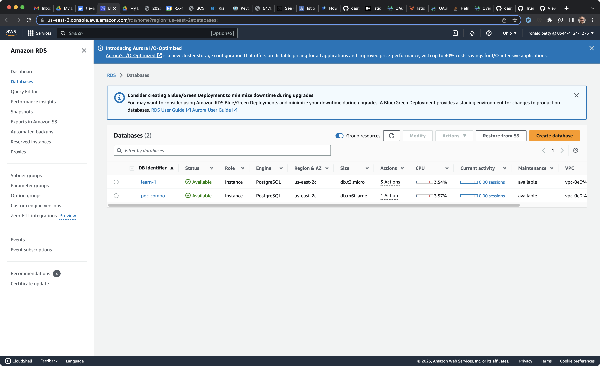
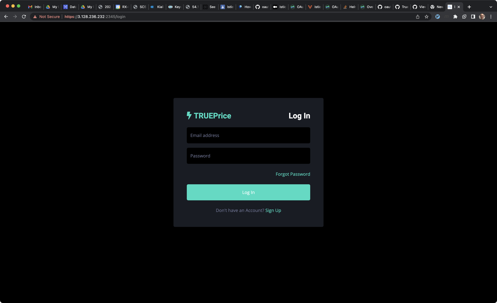

# About

This repository (poc-combo) contains the replacement for the both:

* Existing TRUEPrice API SaaS system hosted in Azure
* Existing TRUEPrice ERCOT Ancillary Extension API hosted in AWS


# History

Years ago Truelight Energy (TLE) decided to produce a SaaS offering. The first version of what became the TRUEPrice SaaS (API and UI) was hosted at Heroku and built with Ruby on Rails. The second version of this system is hosted at Azure and rewritten in C#. The third version of the system is hosted at AWS and written in Python.

Various forces led to the aforementioned changes. We won't highlight them all here, will mentioned the move from Azure to AWS is based primarily on the complexity of the C# system and Azure hosting complexities. In theory the tools and techniques used were standard; the system though was hard to operate and maintain due to lack of shared knowledge. An attempt was made to relearn and refactor the system, but pressure from the client and deprecation warnings from Azure made this goal impractical. It was then decided to rework the API with focus on operational simplicity (e.g. don't force users to login to VMs and place files in shared folder -- now we just upload via html form; e.g. avoid use of ORM and in general code generation tools -- simple flask API script; e.g. avoid Active Directory). Other challenges exist with version 2 (Azure) including deprecation of .NET 5, Kubernetes versioning, lack of documentation on CosmoDB and related CRON jobs.

In 2022, TLE was asked by a client to add ERCOT Ancillary information to the API. Per aforementioned complexities, it was decided we would build a new system. This system which is housed in another repo (https://github.com/Truelightenergy/poc-ercot-ancillary-curve) is a Go based system backed by MongoDB both running in containers (in Docker but not on Kubernetes) in AWS. After a period of time, TLE (through internal discussions) decided to proceed with a slightly more vanilla technology stack. So instead of this project become version 3 of the TRUEPrice API, it really is just an addon to TRUEPrice API v2 (Azure) offering. Version 3 (Python in AWS) will expose the same data.

TRUEPrice version names:

* v1 - Ruby on Rails (Heroku)
* v2 - C# (Azure) + Go (AWS)
* v3 - Python (AWS)

Here is a mapping to repos. There is a high probability of code, configuration, documentation that is missing from this list.

* v1 - https://github.com/Truelightenergy/truelight
* v2 - https://github.com/Truelightenergy/trueprice_azure_backup
* v2 ERCOT addon - https://github.com/Truelightenergy/poc-ercot-ancillary-curve
---
* v3 - https://github.com/Truelightenergy/poc-combo

Once v3 passes testing, v2 databases are moved to AWS (and ultimately backfills the v3 database -- SQL Server and MongoDB) and DNS reconfigured (e.g. trueprice.truelightenergy.com) Azure will be discontinued.


# v3 Production

System resides in AWS us-east-2 region. Consists of 1 EC2 instance calling out to RDS and S3.

## Production Database - (Postgres hosted in AWS RDS)

* Postgres 15 (hosted)
* database aws identifier "poc-combo" (maybe should rename to TRUEPrice_API)
* logical database is called "truprice"
* schema is called trueprice (`postgres=> \c trueprice`)
* database admin user is "postgres", AWS secret manager has password
* poc-combo application and pgcat proxy use the app user "docker" and password (ask Ron or reset it)
* tables (as of 2-July-2023)
```
~$ psql -h poc-combo.cdcasjjgwquj.us-east-2.rds.amazonaws.com  -p 5432 -U docker trueprice -c "\dt+ trueprice.*"
Password for user docker: 
                                               List of relations
  Schema   |          Name           | Type  | Owner  | Persistence | Access method |    Size    | Description 
-----------+-------------------------+-------+--------+-------------+---------------+------------+-------------
 trueprice | column_authorization    | table | docker | permanent   | heap          | 16 kB      | 
 trueprice | ercot_energy            | table | docker | permanent   | heap          | 2240 kB    | 
 trueprice | ercot_energy_history    | table | docker | permanent   | heap          | 2672 kB    | 
 trueprice | ercot_nonenergy         | table | docker | permanent   | heap          | 3424 kB    | 
 trueprice | ercot_nonenergy_history | table | docker | permanent   | heap          | 1808 kB    | 
 trueprice | ercot_rec               | table | docker | permanent   | heap          | 776 kB     | 
 trueprice | ercot_rec_history       | table | docker | permanent   | heap          | 448 kB     | 
 trueprice | isone_energy            | table | docker | permanent   | heap          | 4624 kB    | 
 trueprice | isone_energy_history    | table | docker | permanent   | heap          | 5648 kB    | 
 trueprice | isone_nonenergy         | table | docker | permanent   | heap          | 3680 kB    | 
 trueprice | isone_nonenergy_history | table | docker | permanent   | heap          | 3912 kB    | 
 trueprice | isone_rec               | table | docker | permanent   | heap          | 7432 kB    | 
 trueprice | isone_rec_history       | table | docker | permanent   | heap          | 3200 kB    | 
 trueprice | miso_energy             | table | docker | permanent   | heap          | 1936 kB    | 
 trueprice | miso_energy_history     | table | docker | permanent   | heap          | 2424 kB    | 
 trueprice | miso_nonenergy          | table | docker | permanent   | heap          | 2176 kB    | 
 trueprice | miso_nonenergy_history  | table | docker | permanent   | heap          | 2288 kB    | 
 trueprice | nyiso_energy            | table | docker | permanent   | heap          | 5328 kB    | 
 trueprice | nyiso_energy_history    | table | docker | permanent   | heap          | 6736 kB    | 
 trueprice | nyiso_nonenergy         | table | docker | permanent   | heap          | 920 kB     | 
 trueprice | nyiso_nonenergy_history | table | docker | permanent   | heap          | 664 kB     | 
 trueprice | nyiso_rec               | table | docker | permanent   | heap          | 1384 kB    | 
 trueprice | nyiso_rec_history       | table | docker | permanent   | heap          | 520 kB     | 
 trueprice | pjm_energy              | table | docker | permanent   | heap          | 10 MB      | 
 trueprice | pjm_energy_history      | table | docker | permanent   | heap          | 12 MB      | 
 trueprice | pjm_nonenergy           | table | docker | permanent   | heap          | 43 MB      | 
 trueprice | pjm_nonenergy_history   | table | docker | permanent   | heap          | 34 MB      | 
 trueprice | pjm_rec                 | table | docker | permanent   | heap          | 7664 kB    | 
 trueprice | pjm_rec_history         | table | docker | permanent   | heap          | 2768 kB    | 
 trueprice | site                    | table | docker | permanent   | heap          | 8192 bytes | 
 trueprice | uploads                 | table | docker | permanent   | heap          | 72 kB      | 
 trueprice | users                   | table | docker | permanent   | heap          | 16 kB      | 
(32 rows)
```

Due to testing with Tableau, we used a proxy so it can access our private database (aka no public IP). Unfortunately, this proxy (pgcat) does not appear to support TLS (yet), nor did pgbouncer. For now, we disabled the forced use of TLS in the RDS database set up (see below). While not ideal, the database is on a private network sans this proxy.

* Custom DB Parameter group (ron-reduce-tls-pgcat)
  * `rds.force_ssl` = 0 (allow non SSL)
* private network access only
  * logs enabled
* TLS disabled (until proxy - pgcat - is configured to use it)
* admin user = postgres
* admin password managed by AWS Secrets Manager
  * auto rotated weekly
* connect example
  * `psql -h poc-combo.cdcasjjgwquj.us-east-2.rds.amazonaws.com  -p 5432 -U postgres postgres`
* application user = docker
* application password = docker
* type db.m6i.large
* not multi-zone (cost) (todo: for HA)
* auto update for minor is enable
* backups are enabled (35 day)

> n.b. In our same AWS RDS account, we have a training instance (learn-1), this was for internal training at TLE, we should consider deleting this and providing read-only access to production (or its replicas if we get one).




## Production Virtual Machine

* Static IP (EIP) - 3.128.236.232
* Ubuntu 22.04
* Two security group sets:
  * To Application below - `sg-0845b17f8a6c42a24 - ercot-poc`
  * Application to database - `sg-06a3c09d03fb11825 - ec2-rds-1`
* S3 access is provided to application via an Instance Profile (arn:aws:iam::054441241273:role/tle-trueprice)

```
{
    "Version": "2012-10-17",
    "Statement": [
        {
            "Sid": "VisualEditor0",
            "Effect": "Allow",
            "Action": "sts:AssumeRole",
            "Resource": "arn:aws:iam::054441241273:role/tle-trueprice"
        },
        {
            "Sid": "VisualEditor1",
            "Effect": "Allow",
            "Action": "s3:*",
            "Resource": "arn:aws:s3:::tle-trueprice-api-source-data/*"
        }
    ]
}
```

S3 is used to store the files as they are uploaded (nothing else at the moment). 


## Application

* Flask based, using "venv" to manage dependencies (see usage below)
* Code is here https://github.com/Truelightenergy/poc-combo
* Deployed manually as Git repo (automate later once we have more clients and money)
* Example upgrade code session
```
ubuntu@ip-172-31-41-181:~$ cd github.com/truelightenergy/poc-combo/
ubuntu@ip-172-31-41-181:~/github.com/truelightenergy/poc-combo$
ubuntu@ip-172-31-41-181:~/github.com/truelightenergy/poc-combo$ source ./app_env/bin/activate

# Do the upgrade (e.g. pull in latest merged PR) - kill existing flask process
ubuntu@ip-172-31-41-181:~/github.com/truelightenergy/poc-combo$ GIT_SSH_COMMAND='ssh -i ~/.ssh/tle_poc_combo_ed25519 -o IdentitiesOnly=yes' git pull

# Note the use of "deployment key" (allows us to pull from GH but not push)
# if needed - `pip3 install -r ./buildContext/src/requirements.txt`
# if needed - update database per changes here `docker/docker-compose.yml`

# Start the app once more
ubuntu@ip-172-31-41-181:~/github.com/truelightenergy/poc-combo$ `/github.com/truelightenergy/poc-combo$ DATABASE=poc-combo.cdcasjjgwquj.us-east-2.rds.amazonaws.com PGPASSWORD=docker PGUSER=docker nohup flask --app ./buildContext/src/trueprice_api run --cert=adhoc --host=0.0.0.0 --port=2345 > flask.log 2>&1 &`

# TIPS
ubuntu@ip-172-31-41-181:~/github.com/truelightenergy/poc-combo$ df -h # check disk space
ubuntu@ip-172-31-41-181:~/github.com/truelightenergy/poc-combo$ htop # check RAM / CPU
ubuntu@ip-172-31-41-181:~/github.com/truelightenergy/poc-combo$ tail flask.log # check app is listening
ubuntu@ip-172-31-41-181:~/github.com/truelightenergy/poc-combo$ # visit website!! try to login/out, download
```

Per warning above, be sure to know what your deploying. If the database has a change, figure out how to do it in production. At this time the database has DDL for creation not altering. We have been lucky so far, only new tables and columns. We had to fix column types in past but it was early enough we just rebuilt. Now that we are in production mode, we need to be much more careful. The schema is defined in `docker/docker-compose.yml`. You may wonder why in a YAML file and not just SQL or txt, its to make local development easier (aka quicker). The entire schema is in one service task called `postgres-setup-1`. The first task is `postgres` which is for local database development (aka start postgres locally). More on development in next section.


# Development (needs updating)

If all works, this is all that is needed to start:

`docker compose -f "docker-compose.yml" up -d --build` # other files like `docker/docker-compose-mac.yml` are due to Mac / Windows / Linux networking differences with Docker; yet idea remains the same

Sometimes (network issues I think), you might have to run these steps:

`docker compose  -f "docker/docker-compose.yml" up -d --build postgres-setup-1 postgres-setup-2`

Setup minio (aka local version of S3):

`mkdir -p ~/minio/data`
* `docker container run -d -p 9000:9000 -p 9090:9090 --name minio -v ~/minio/data:/data -e "MINIO_ROOT_USER=ROOTNAME" -e "MINIO_ROOT_PASSWORD=CHANGEME123" quay.io/minio/minio server /data --console-address ":9090"`

Grafana was considered before Tableau (for cost). Since we decided to use Tableau we have halted further use of Grafana (or other admin contain for postgres). This note is in case you want to try to use it again:

> Grafana needs the postgres datasource added (and dashboards). Here is a blog explaining how that might be accomplished during build time: https://community.grafana.com/t/data-source-on-startup/8618/2


# Activity (things are missing here, but general timeline if we remember to update)

* 21-May-2023 (major update)
  * rename prior database (users)
  * rebuild database (lots of SQL changes, wanted to not get bogged down in alters -- and to reconfirm we are in command of DB setup)
  * pull hundreds of changes (UI mostly, new headers, bug fixes, etc.)
  * test

* 2-July-2023
  * updated Postgres in RDS (Postgres minor version upgrade, OS patches)



# Code

* Source code is located `buildContext/src` (including `requirements.txt`)
  * `buildContext/src/extractors` are for downloading
  * `buildContext/src/ingestors` are for uploading
  * `buildContext/src/blueprints` are the "helpers" for the prior items
  * `buildContext/src/templates` and buildContext/src/static are for the UI
* Test data is located `buildContext/good_test_data` (good tests, not bad tests)
* Test scripts (for API) are located `curl_tests`
* Swagger / OpenAPI is provided in UI via `https://3.128.236.232:2345/apidocs`
